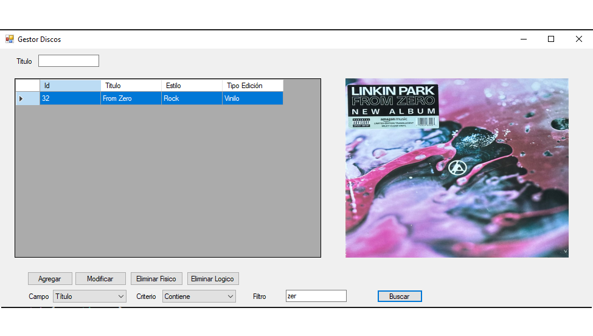
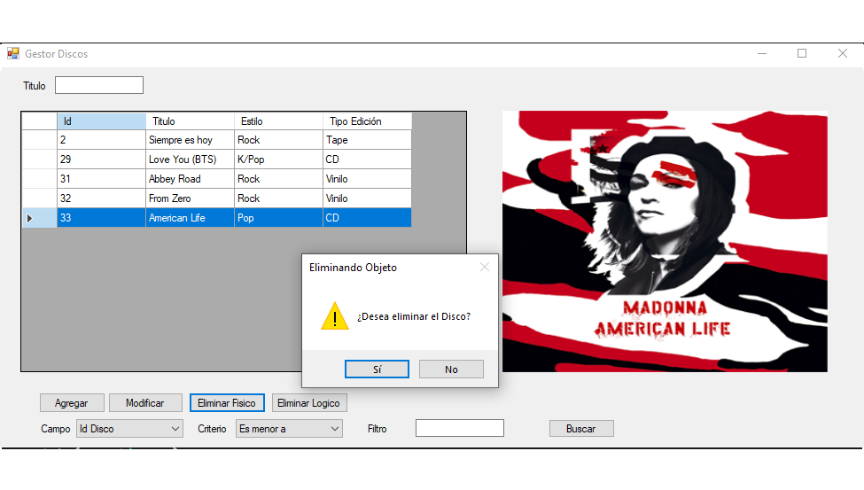

# Proyecto en desarollo

Aplicación de escritorio desarrollada en .NET que permite la gestión de una base de datos de discos musicales.
Incluye funcionalidades para filtrar, agregar, modificar y eliminar registros desde una interfaz intuitiva.

## Ventana filtro

## Ventana Agregado

## Ventana Eliminación

## Ventana Eliminación (Lógica)
.png)

