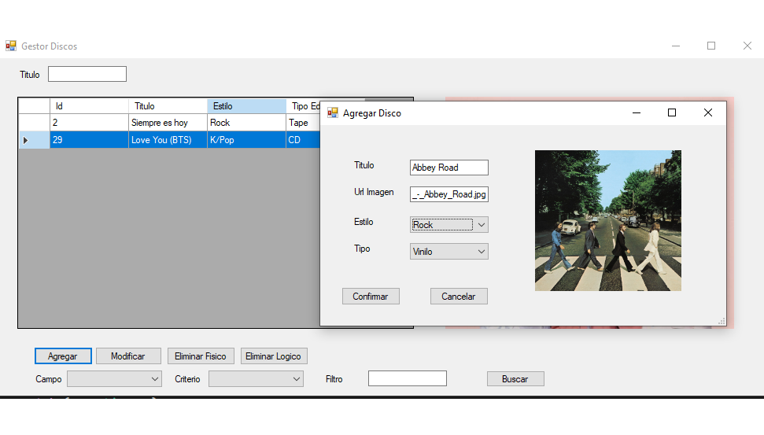

#**Proyecto en Desarollo**

Aplicación de escritorio desarrollada en .NET que permite la gestión de una base de datos de discos musicales.
Incluye funcionalidades para filtrar, agregar, modificar y eliminar registros desde una interfaz intuitiva.

